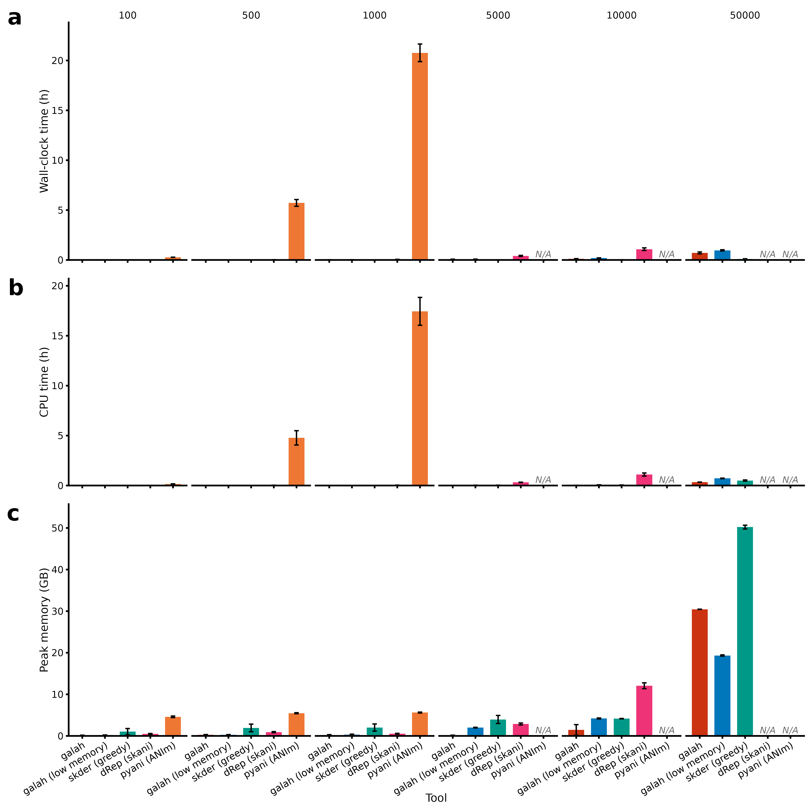
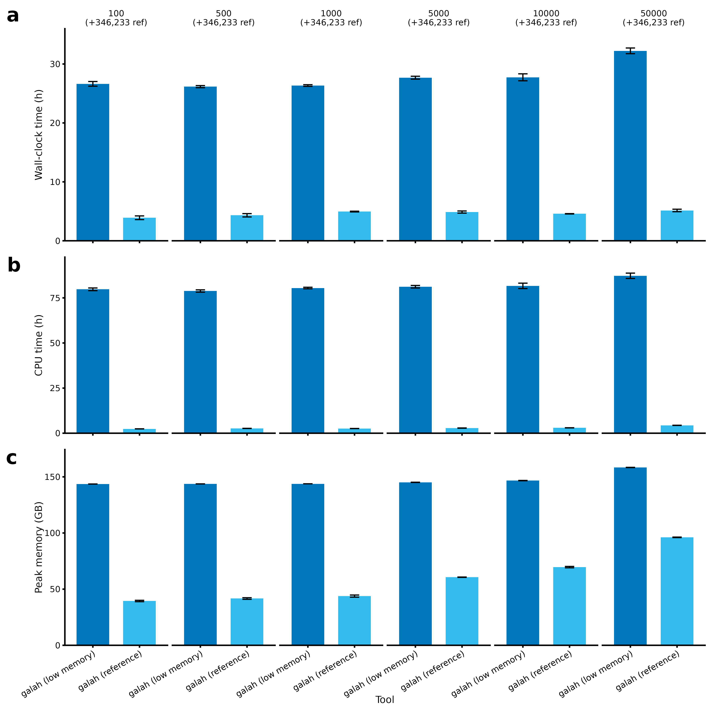
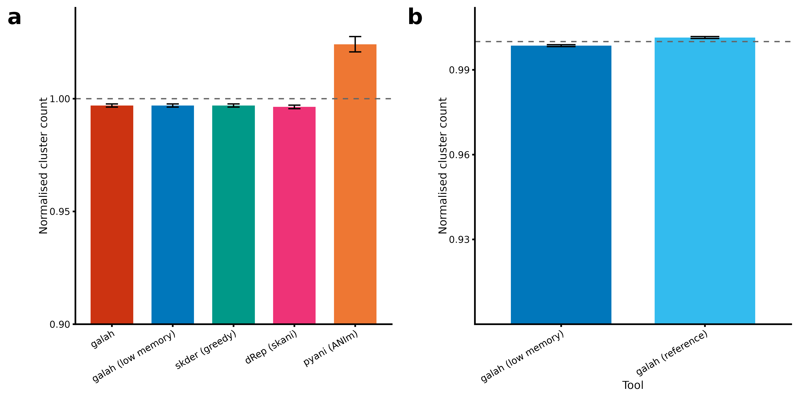

# Galah benchmarking

## Standard benchmark

[Galah](https://github.com/wwood/galah) was benchmarked against [skDER](https://github.com/raufs/skDER) (greedy clustering with skani), [dRep](https://drep.readthedocs.io/) (using skani), and [pyani](https://github.com/widdowquinn/pyani) (ANIm) at 100, 500, 1,000, 5,000, 10,000 and 50,000 genomes, using 32 CPUs, 250GB memory, and a 48-hour walltime limit.

**Figure S1: Dereplication benchmarking.** We benchmarked galah with defaults and galah in “low memory” mode against skDER (greedy clustering with skani), dRep (using skani), and pyANI (ANIm) at 100, 500, 1,000, 5,000, 10,000 and 50,000 genomes, with 5 independent genome samplings, using 32 CPUs, 250GB memory, and a 48-hour walltime limit. Bars represent mean ± standard error of (a) total walltime, (b) CPU time, and (c) peak memory for each process. Jobs that exceeded either total RAM or walltime are represented by N/A, not available.

## Clustering against a reference catalogue

Growing a genome catalogue over time usually means re-dereplicating everything from scratch against the new batch of genomes.
Galah's `--reference-genomes` option instead lets new genomes be clustered directly against an already-dereplicated reference set: the new genomes are first dereplicated amongst themselves (so they don't need to be pre-dereplicated by the caller), and only the resulting representative(s) are then compared against the reference set - reference-vs-reference comparisons are never made, so only a small number of input-vs-reference comparisons are needed, rather than all-vs-all.

We benchmarked this by clustering 100 to 50,000 input genomes against all 346,233 genomes in [GlobDB](https://globdb.org/) r232 as reference genomes, comparing galah's low-memory mode (clustering the input genomes together with all reference genomes) against galah's `--reference-genomes` mode (clustering the new genomes against the pre-existing reference set). No other tool benchmarked above was able to complete this comparison under the same resource limits.

**Figure S2: Reference genome benchmarking.** We benchmarked galah with defaults, galah in “low memory” mode, and galah in “reference genome” mode against skDER (greedy clustering with skani), dRep (using skani), and pyANI (ANIm) at 100, 500, 1,000, 5,000, 10,000 and 50,000 genomes against 346,233 reference genomes, with 5 independent genome samplings, using 32 CPUs, 250GB memory, and a 48-hour walltime limit. Tools without a reference genome mode were given the genomes as a single package. Notably, only galah in “low memory” mode and galah in “reference genome” mode were able to complete dereplication using the provided resources. Bars represent mean ± standard error of (a) total walltime, (b) CPU time, and (c) peak memory for each process. Tools that exceeded either total RAM or walltime are not pictured.

## Comparison of clusters formed

Despite the large resource differences, cluster assignments are highly consistent between tools across both benchmarks, with the exception of pyani which uses a different clustering method.

**Figure S3: Cluster formation in benchmarks.** Normalised  cluster count (calculated as the proportional difference from the mean across all tools for a given replicate) for (a) the basic dereplication benchmark and (b) the reference genome dereplication benchmark. Bars represent mean ± standard error.
